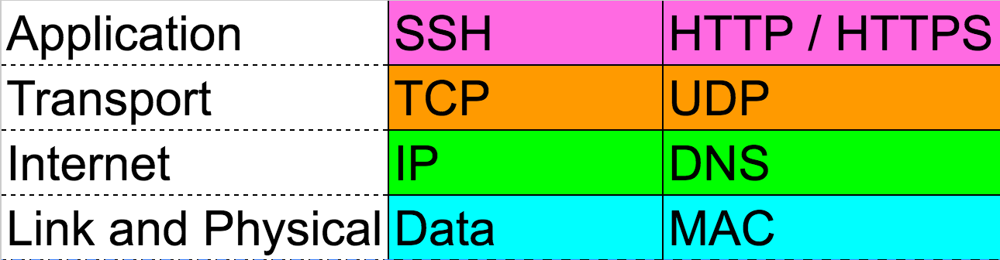
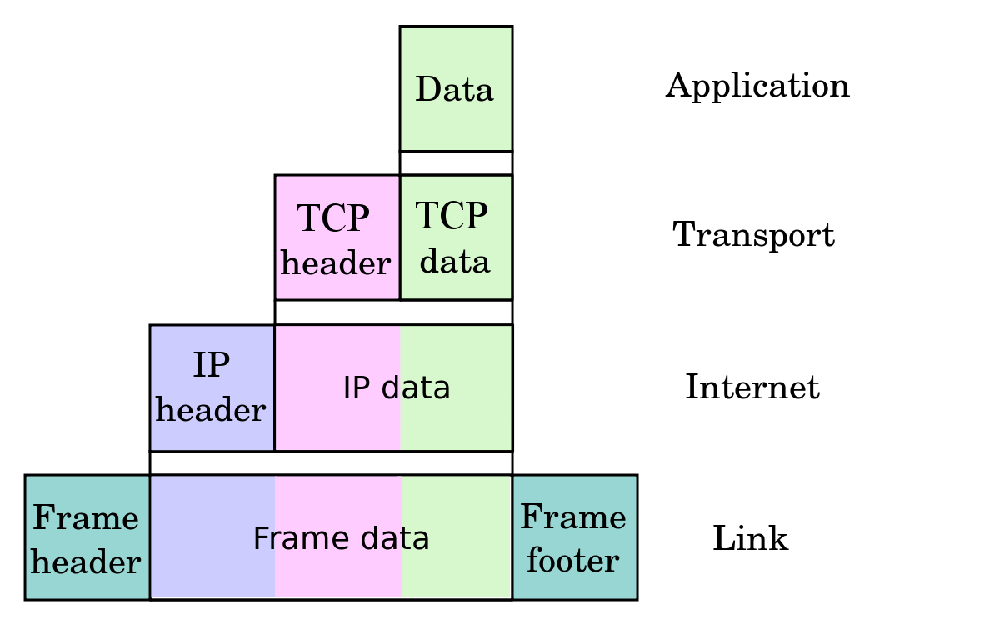

<!--
Creator: Ilias Tsangaris
Market: SF
Adapted by: Zeb Girouard
-->

<!--11:10 5 minutes -->

<!-- Hook:

Who has ever watched a hacker or computer movie, and been like, "Wow, that is so not how the Internet works"?  And who has ever stopped and thought, "Wait, is it?"  Today, we're going to talk about that so whenever we want to be Internet snobs, we have a strong basis for our snobbery.
-->

# How the Internet Works

## Why is this important?
*This workshop is relevant to developers because:*

Just how a race-car driver should understand how their car runs, it is imperative for web developers to have clear mental models of the Internet functions when building web applications. Knowledge of Internet fundamentals will allow for new concepts to be understood in a more complete context.

## What are the objectives?
*After this workshop, developers will be able to:*

* **Explain** at a high level how the Internet transmits data
* **Distinguish** between the Internet and the World Wide Web
* **Understand** why HTML CSS and JavaScript work together so well
* **Articulate** what an API is

## Where should we be now?
*Before this workshop, developers should already be able to:*

* Use the Internet

<!--11:15 10 minutes -->

## The Internet

    
How did the Internet begin?

    <figure>
        <h3>The First Internet Communication</h3>
        
         
        <figcaption>"Lo" and behold, the first Internet communication was sent over a network of computers called the ARPANET from UCLA to Stanford.</figcaption>
    </figure>

    
How does data travel through the internet?

    <figure>
        <h3>Data Packets</h3>
        
         
        <figcaption>Any data you send over the Internet is split up into data packets. Each packet is routed to the destination eventually, but may all take different paths to get there.</figcaption>
    </figure>

    
How is the network structured?

    <figure>
        <h3>Major Nodes in the Network</h3>
        
         
        <figcaption>The Internet is a global network of networks connected through a set of Internet exchange points</figcaption>
    </figure>

    
What does a connection look like?

    <figure>
        <h3>Undersea Internet Cable</h3>
        
         
        <figcaption>All data transmitted across the Internet is eventually communicated through a fiber optic cable as flashes of light.</figcaption>
    </figure>

    
How does all that data flow through one cable?

    <figure>
        <h3>Multiplexing</h3>
        
         
        <figcaption>Multiplexing allows multiple data streams to share one wire by splitting each stream into a separate channel with a different bandwidth.</figcaption>
    </figure>

<!-- **CFU:**
	- Explain Whip-around - write on board
	- Whip-around on repeat with whole class all Q's above
-->

<!--11:25 10 minutes -->

## The Internet Protocol Suite

    
What are the distinct layers of the Internet protocol suite?

    <figure>
        <h3>Internet Protocol Suite</h3>
        
         
        <figcaption>The suite is a set of communication protocols used in tandem on the Internet. These protocols work together to facilitate a variety of networked communications.</figcaption>
    </figure>

    
What happens at each layer?

    <figure>
        <h3>Encapsulation / Decapsulation</h3>
        
         
        <figcaption>At each layer, a header and/or footer is added to the raw data that a computer is trying to send.</figcaption>
    </figure>

    
What does TCP/IP mean?

    <figure>
        <h3>It's part of the Internet Protocol Suite</h3>
        
         
        <figcaption>TCP/IP stands for Transmission Control Protocol/Internet Protocol. TCP lives on the transport layer and is the protocol that ensures the data sent is reliable, ordered, and error-checked. IP lives on the Internet (or Internetwork) layer and the is the protocol concerned with routing data grams through the network efficiently.</figcaption>
    </figure>

    
What is the DNS and why is it useful?

    <figure>
        <h3>Domain Name System</h3>
        
         
        <figcaption>The DNS is an Application layer protocol for translating "human-friendly" computer hostnames into IP addresses. Think of it like a contact list as it allows one to lookup a phone number based on a memorable name.</figcaption>
    </figure>

<!-- **CFU:**
	- Review Whip-around
	- Whip-around on repeat with whole class all Q's above (reverse of last time)
-->

<!--11:35 5 minutes -->

<!-- Play a packet's tale -->

<!--11:40 15 minutes -->

## The World Wide Web

    
How does the World Wide Web compare to the Internet?

    <figure>
        <h3>World Wide Web vs The Internet</h3>
        
         
        <figcaption>The Internet is the actual network that connects computers together and encompasses a wide range of protocols. The World Wide Web only represents a specific protocol on the Application layer of the Internet Protocol Suite.</figcaption>
    </figure>

    
What protocol does the WWW use to communicate?

    <figure>
        <h3>HTTP</h3>
        
         
        <figcaption>HTTP is a protocol on the application layer that the World Wide Web uses to communicate. It is responsible for delivering HyperText files and applications. More specifically, browsers rendering HTML files will use the WWW.</figcaption>
    </figure>

    
Who invented the World Wide Web?

    <figure>
        <h3>Tim Berners Lee</h3>
        
         
        <figcaption>Tim devised a system for sharing HyperText documents while at CERN. During the late 80s and early 90s he specified the first versions of HTML and HTTP that ended up birthing the World Wide Web and changing the usability of the Internet forever.</figcaption>
    </figure>

    
What is HyperText?

    <figure>
        <h3>The Mother of All Demos</h3>
        
         
        <figcaption>In the '60s Douglas Engelbart [demonstrated](https://www.youtube.com/watch?v=yJDv-zdhzMY) a machine that was capable of rich media, collaborative text editing, and teleconferencing. Now HTML, aka HyperText Markup Language, enables anyone to design rich media documents that are literally "beyond" (hyper) text.</figcaption>
    </figure>

    
Who is in charge of the WWW?

    <figure>
        <h3>W3C</h3>
        
         
        <figcaption>The Technical Architecture Group meets regularly to discuss, document, and build Web standards. This group consists of 9 participants, some from outside organizations like Microsoft, Google, and Mozilla. They are known as the World Wide Web Consortium or W3C.</figcaption>
    </figure>

    
So how does HTML relate to CSS and Javascript?

    <figure>
        <h3>CSS & JS Endow Style and Behavior to HTML</h3>
        
         
        <figcaption>You can think of HTML CSS and JS as the three major parts of speech in human language: nouns, adjectives, and verbs. HTML is the noun as it is in charge of organizing content (text, photos, videos, audio, links, etc) into a file. CSS is the adjective as it is entirely concerned with the visualization of the content. JavaScript is the verb as it can add behavior and dynamism to the content.</figcaption>
    </figure>

    
What are the distinct parts of a URL?

    <figure>
        <h3>URL</h3>
        <pre>
		http://www.kittengifs.com:80/popular-gifs#results?term=cute&page=2
		|-----|-----------------|---|-----------|--------|----------------|
		   |           |          |       |          |           |
		 protocol    host       port    path     fragment  query-string
        </pre>
        <figcaption>
        	<ul>
	        	<li>Protocol: a set of conventions regarding how information will be communicated</li>
			<li>Host - the server that is connected to</li>
			<li>Port (optional) - the target port on that server</li>
			<li>Path - the specific file or data that is accessed on the server</li>
			<li>Fragment (optional) - used to jump to a specific `id` of the page</li>
			<li>Query String (optional) - used to include additional information about what we're requesting</li>
		</ul>
        </figcaption>
    </figure>

<!-- **CFU:**
	- Whip-around on repeat with whole class all Q's above (start in middle)
-->

<!-- Packet live demo with volunteers -->

<!--11:55 10 minutes -->

## APIs

    
What is the definition of an API?

    <figure>
        <h3>Application Programming Interface</h3>
        
         
        <figcaption>An API is simply the interface for how one interacts with a piece of software. In programming a string of characters, such as `"hello"`, is refered to as a String. From the above example, we see that `.upcase` is part of a String's API.</figcaption>
    </figure>

    
Can you give me a real world example of one?

    <figure>
        <h3>A Restaurant</h3>
        
         
        <figcaption>The purpose of a restaurant is to abstract the effort of making food away from the client. A restaurant's menu represents their API. The server waits on a client for a request. When ordering, the client references the restaurant's API, the menu, to send a specific, predefined request to the server. When the server delivers the dish back to the client's table, the request is completed with a response (more on the request/response cycle later).</figcaption>
    </figure>

    
When we talk about Twitter's API, what does that mean?

    <figure>
        <h3>An Interface to Twitter's Data</h3>
        
         
        <figcaption>Developers may want a way to access Twitter's data, so Twitter exposes an interface for them to do so. Big companies exposing their data over the internet is an extremely simplified idea of what an API is. Literally every piece of software, at some level, has an interface to access it!</figcaption>
    </figure>

    
How could we interact with a third party's web API?

    <figure>
        <h3>The Request/Response Cycle</h3>
        
         
        <figcaption>Every time you visit a webpage your computer is acting as a client that will send a request to a URL. This URL maps to a specific server somewhere else in the world. That server is tasked with responding back to you with the information you have requested. Each request must contain two things: **a URL**, which represents the location, and an **HTTP Verb**, which represents the intent. The verb options are: POST, GET, PUT, and DELETE, which mean you want to respectively Create, Read, Update, or Delete (CRUD) data located at a specific location.</figcaption>
    </figure>

<!-- **CFU:**
	- Whip-around on repeat with whole class all Q's above (reverse from middle)
-->

<!--12:05 5 minutes -->

## Q & A

## Closing Thoughts

There's tons of technical acronyms and jargon in the world. Understanding the basic building blocks of Internet & web technologies will help you communicate, grasp new concepts independently, and demystify concepts on your learning journey to become better web developers.

<!-- **Personal Closing**

I am more than happy to help with any of this.  If you have an error, and you're pretty sure it's a connection issue, let me know.  This was basically all I did for about a year.  I love working through these problems.

I also highly recommend, if you haven't done it yet, going into a server room and really seeing how these machines connect.  It gives you a whole new appreciation for things.
-->

<!--If time, this is where we should do a GH issue lab before lunch -- something like "How do you reverse a Linked List in Javascript?", submit issues to this repo, 2 online resources and one developer you talked to -->

## Further Resources

* [A Packet's Tale Video](https://www.youtube.com/watch?v=Gfoc3Cxgnpk)
* [HTTP Intro](https://dev.opera.com/articles/http-basic-introduction/)
* [TCP/IP Protocol Explained](http://www.thegeekstuff.com/2011/11/tcp-ip-fundamentals/)
* [Internet Protocol Suite Wikipedia Page](https://en.wikipedia.org/wiki/Internet_protocol_suite)
* [How the Internet Works — Stanford](http://web.stanford.edu/class/msande91si/www-spr04/readings/week1/InternetWhitepaper.htm)

## Licensing
All content is licensed under a CC­BY­NC­SA 4.0 license.
All software code is licensed under GNU GPLv3. For commercial use or alternative licensing, please contact legal@ga.co.
